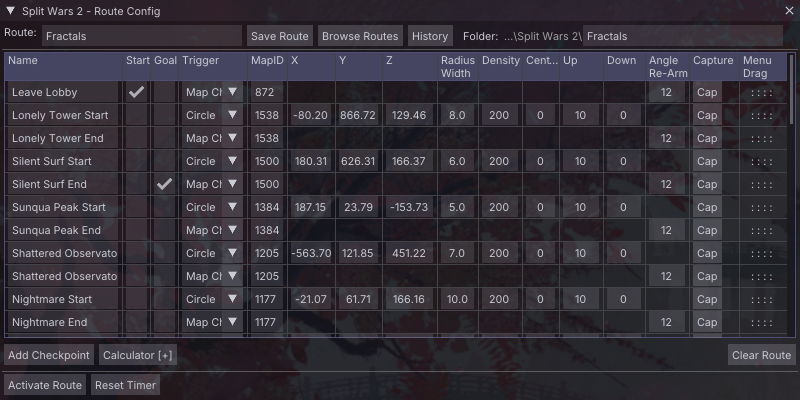
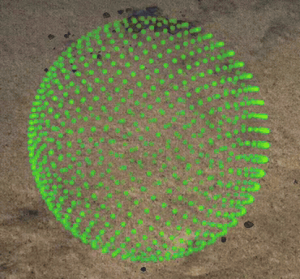
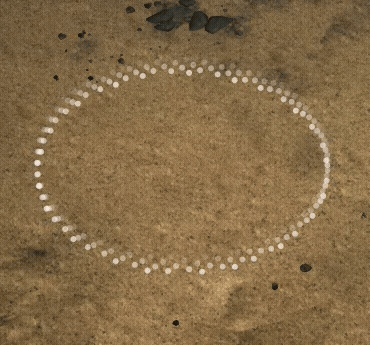
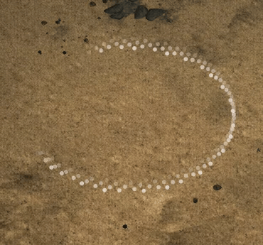
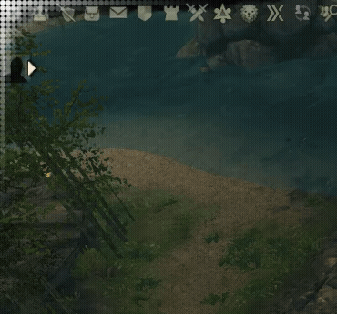
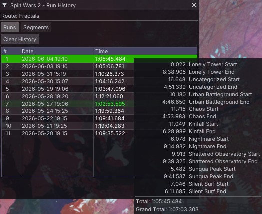
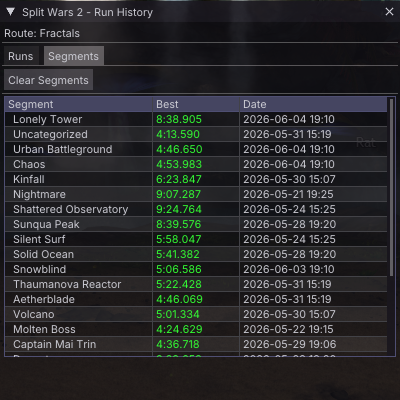
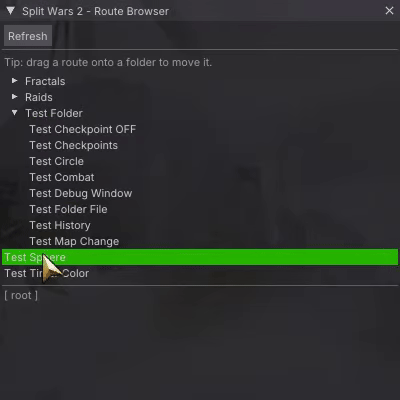

# Split Wars 2

> A coordinate-based speedrun timer addon for **Guild Wars 2**, built for the [Nexus](https://raidcore.gg/Nexus) addon framework.

> [!WARNING]
> **AI Notice** — Split Wars 2 was developed with heavy use of AI assistance, specifically [Claude](https://claude.ai) by Anthropic. From architecture decisions and refactoring to bug hunting and documentation, Claude was a core part of the development process.

> [!NOTE]
> **Requirements & Installation**
>
> - Requires the [Nexus](https://raidcore.gg/Nexus) addon loader and Guild Wars 2
>> - Optional: [Real Time API](https://github.com/TyrianDeveloperCollective/GW2-RealTime-API-Releases) for enhanced precision and death detection
> - Download the latest `.dll` from [Releases](../../releases) and place it in your Nexus addons folder (`Guild Wars 2/addons`)
> - In Nexus, find Split Wars 2 in the addon list and press **Load**

---

## What is Split Wars 2?

Split Wars 2 is a speedrun timer that starts, splits, and stops automatically based on your character's position in the game world — no manual input needed mid-run. Place trigger zones in the world, walk through them, and the timer does the rest.

Routes are plain JSON files, easy to share and edit. Run history is saved alongside each route so you always have your personal bests to compare against.

---

## All Features at a Glance

- **Automatic timer** — starts, splits, and stops on position triggers, no manual input mid-run
- **Multiple goals** — routes can have more than one goal for diverging paths
- **Six trigger types** — Circle, Plane, Map Change, Interact, Combat (Native), All Checkpoints
- **Three timer modes** — Segment, Split, LiveSplit
- **Grand Total timer** — wall-clock time including loads
- **Run history** — auto-saved, trimmed to your configured limit
- **Best segment tracking** — per-segment personal bests across all runs (Start/End suffix needed)
- **Route browser** — folder-based organisation, drag-to-move
- **JSON routes** — for easy sharing
- **In-world overlays** — dot spheres and planes with color, density, and fade controls
- **RTAPI support** — optional Real Time API for precise death detection in Combat triggers
- **Compact mode** — collapses the timer to a single line
- **Nexus hotbar** — quick access button with right-click context menu
- **Keybinds** — every major action is bindable in Nexus

---

## Trigger Types

Each checkpoint — including start and goal — can use any of these trigger modes. They render as visible overlays in the game world so you always know where your triggers are.

| Trigger | How it fires | Overlay |
|---|---|---|
| **Circle** | Enter the zone (all checkpoints); leave the zone (start only) | Dot sphere |
| **Plane** | Cross the line from either direction | Dot plane |
| **Map Change** | Leave a specified map | Dot corner |
| **Interact** | Press your interact key inside the zone | Dot sphere (rotate) |
| **Combat (Native)** | Enter combat inside the zone; fire again when combat ends | Dot sphere (lub-dub) |
| **All Checkpoints** *(goal only)* | Every other checkpoint has been triggered | none |

<table>
  <tr>
    <td align="center" colspan=3><b>Visualization</b></td>
  </tr>
  <tr>
    <td align="center"><b>Adjust Colors</b> </td>
    <td align="center"><b>Circle Trigger</b> </td>
    <td align="center"><b>Plane Trigger</b> </td>
  </tr>
  <tr>
    <td align="center"><b>Interact Trigger</b> </td>
    <td align="center"><b>Combat Trigger</b> </td>
    <td align="center" colspan="2"><b>MapChange trigger</b> </td>
  </tr>
</table>

---

## Timer Display Modes

Cycle through display modes with a keybind at any time:

| Mode | Running timer | Split comparison |
|---|---|---|
| **Segment** | Current segment time | vs. your best segment time |
| **Split** | Cumulative elapsed time | vs. your best cumulative time |
| **LiveSplit** | Current segment time | vs. your best cumulative time (LiveSplit style) |

A secondary **Grand Total** timer runs in parallel and tracks wall-clock time across the full session, including load screens.

---

## Run History & Segment Tracking

Every completed run is saved automatically to a `.history` file next to your route. The history window gives you a full breakdown of every run and every split.

<table>
  <tr>
    <td align="center"><b>Run history with split hover</b> </td>
    <td align="center"><b>Best segment times</b> </td>
  </tr>
</table>

- Hover any run to see its full split breakdown inline
- Switch to the **Segments** tab for a dedicated best-of view across all your runs
- Promote any historical run to your **best run** reference for live split comparison
- Configurable history limit (1–100 runs); oldest unprotected runs are trimmed automatically
- Copy single runs to your clipboard and easily drop them into Excel, Google Sheets or LibreOffice Calc

---

## Route Browser & Organisation

Routes are stored as `.json` files and organised in folders beneath the Split Wars 2 addon directory. The browser window lets you navigate, load, and reorganise them without leaving the game.

<table>
  <tr>
    <td align="center"><b>Run history with split hover</b> </td>
    <td align="center"><b>Best segment times</b> </td>
  </tr>
</table>

- Drag a route onto a folder to move it
- Routes and their history files always move together
- The save path in the config window is locked to the addon directory and subfolders only

---

## World Overlay & Occlusion

Trigger zones render as dot-based overlays directly in the game world. They're occluded by a fixed range around the character and ImGui's UI so they never clutter your screen when they're behind something.
**Note** Everything is still rendered on top of GW2's UI.

Zone colors and fade distances are configurable globally in the options panel.

https://github.com/user-attachments/assets/b1ba9c16-92b8-40c9-8330-780ef8b5f114

---

## Data Source

Split Wars 2 reads position data from **MumbleLink** by default, which is always available in GW2. Installing the optional [Real Time API](https://github.com/TyrianDeveloperCollective/GW2-RealTime-API-Releases) unlocks more precise death detection for Combat triggers — particularly useful on runs where dying mid-arena would ruin your splits.

The active data source can be set in the options panel: 
- **Default** (RTAPI if available, Mumble otherwise)
- **Mumble only**
- **RTAPI only** (which also falls back to Mumble if unavailable).
